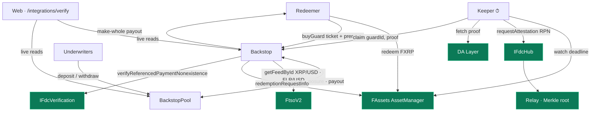

<div align="center">
  

  <h1>Backstop 🛟</h1>
  <p><em>Redemption insurance for FXRP — if your redemption agent never delivers XRP, Flare's own on-chain proof pays you make-whole</em></p>
  

  <br/>

  [](https://backstop.edycu.dev)
  [](https://backstop.edycu.dev/pitch)
  [](https://youtu.be/4QMxKJnWcSE)
  [](https://coston2-explorer.flare.network/tx/0x5774a7631bdcfcf4d0bc90c25a3ce2c08664451213c617450d73b3a8149c540a)
  [](https://coston2-explorer.flare.network/address/0x38EB571B43C6eC03e37c8fC9514640D9d743DDca)
  [](https://dorahacks.io/hackathon/flaresummersignal)

  <br/>

  
  
  
  
  
  
  
  [](https://github.com/edycutjong/backstop/actions/workflows/ci.yml)
  [](https://github.com/edycutjong/backstop/releases)

</div>

---

## ⚠️ The problem

FAssets let XRP holders bring their asset into Flare DeFi — but the **redemption** leg (turning
FXRP back into native XRP) is the riskiest step. When you redeem, an assigned agent must send you
XRP by a deadline. If it doesn't, *you* have to notice the miss, commission a Flare Data Connector
proof yourself, call `redemptionPaymentDefault()`, and accept collateral compensation at a haircut.
It's manual, slow, and uncertain — and that uncertainty keeps desks and treasuries from redeeming at
size, quietly weakening confidence in the FXRP peg.

## 🛟 The solution

Backstop turns that into a one-click guarantee. You buy a **guard** bound to your on-chain
redemption ticket for a small FTSO-priced premium. An autonomous **keeper** watches the deadline. If
the agent doesn't pay, **anyone** can submit Flare's FDC `ReferencedPaymentNonexistence` attestation
— the *exact* proof the FAssets protocol itself accepts for a redemption default — and Backstop
verifies it on-chain and pays you make-whole instantly. Underwriters fund the pool and earn the
premiums of every guard whose agent paid on time.

**Backstop doesn't re-invent cross-chain trust — it rides Flare's own default mechanism.**

## 🔥 Why this needs Flare — and only Flare

Six engine-class Flare methods, wired in code and proven on Coston2:

| # | Flare method | Role in Backstop |
|---|---|---|
| 1 | `IFdcVerification.verifyReferencedPaymentNonexistence` | the claim gate — proves the agent did NOT pay |
| 2 | `IFdcHub.requestAttestation` (RPN) | keeper requests the non-payment attestation |
| 3 | FDC DA-Layer proof fetch | retrieves the finalized proof + Merkle path |
| 4 | `IAssetManager.redemptionRequestInfo` | binds a guard to a real FXRP redemption ticket |
| 5 | `FtsoV2.getFeedById` (XRP/USD, FLR/USD) | sizes coverage + prices premium/payout |
| 6 | `FlareContractRegistry.getContractAddressByName` | resolves everything — nothing hardcoded |

> **Take Flare out and you'd need four separate systems**: a cross-chain XRPL light client, a
> decentralized "payment-did-not-happen" attestation network, a price oracle, and a canonical FXRP
> redemption registry. Backstop is ~600 lines of Solidity *because* Flare enshrines all four — and
> FDC's non-existence proof is something almost no other chain exposes natively.

## 🏗️ Architecture



Contracts resolve every Flare address through the registry (`RegistryResolver`); the keeper is a
convenience, not a trust assumption — the `claim` path is permissionless, so the redeemer or anyone
can submit the proof.

## 🔁 The one flow

`buyGuard` → agent misses deadline → keeper requests RPN proof → `claim` verifies it on-chain → **make-whole payout**

## ✅ Proof: the Day-4 FDC gate (PASSED)

The whole product hinges on one assertion: that the FDC non-existence round-trip actually works on
Coston2. We front-loaded it as a go/no-go gate — [`scripts/spike.ts`](scripts/spike.ts) exercises
every load-bearing call-site end-to-end and prints PASS/FAIL. Run `npm run spike:view` (no wallet)
or `npm run spike:all` (funded).

> **✅ PASSED on Coston2 (2026-07-29).** All five stages green. The load-bearing leg —
> `IFdcHub.requestAttestation` → DA-Layer proof → `IFdcVerification.verifyReferencedPaymentNonexistence`
> — returned **`true` on-chain in 99.3 s**
> (tx [`0x5774a763…9c540a`](https://coston2-explorer.flare.network/tx/0x5774a7631bdcfcf4d0bc90c25a3ce2c08664451213c617450d73b3a8149c540a),
> voting round 1409442). Full benchmark + reproduce steps: [`DEMO.md`](DEMO.md).

## 🚀 Deployed on Coston2 (chain 114) — verified source

| Contract | Address |
|---|---|
| `Backstop` | [`0x38EB571B43C6eC03e37c8fC9514640D9d743DDca`](https://coston2-explorer.flare.network/address/0x38EB571B43C6eC03e37c8fC9514640D9d743DDca) |
| `BackstopPool` | [`0xc18BDf574Ce129aa9dD7DCc80810CceE61200045`](https://coston2-explorer.flare.network/address/0xc18BDf574Ce129aa9dD7DCc80810CceE61200045) |

Both source-verified on Blockscout. Deploy script: [`script/Deploy.s.sol`](script/Deploy.s.sol).

## 🧩 Components

| Layer | Where | What |
|---|---|---|
| **Contracts** | [`src/`](src) | `Backstop` (guard lifecycle + claim), `BackstopPool` (underwriting), `PremiumMath`, `RegistryResolver` |
| **Keeper** | [`scripts/keeper.ts`](scripts/keeper.ts) | autonomous watcher — detects breaches, requests the RPN proof, submits `claim`. `--once` / `--dry-run` modes ([`scripts/KEEPER.md`](scripts/KEEPER.md)) |
| **Spike** | [`scripts/spike.ts`](scripts/spike.ts) | the Day-4 gate harness (stages a–e) |
| **Web** | [`web/`](web) | Next.js dApp reading live Coston2 state, incl. the `/integrations/verify` proof route |

## 🧪 Testing

**87 unit tests · 100% coverage** (lines / statements / branches / functions) across all four
contracts, **plus 4 live-Coston2 fork integration tests** ([`test/ForkCoston2.t.sol`](test/ForkCoston2.t.sol))
against the real registry, FtsoV2, and AssetManager. The fork tests skip automatically when no
`COSTON2_RPC_URL` is set, so offline CI stays green (**91 tests** with a fork).

```bash
forge test                 # 87 offline · 91 with a Coston2 RPC
forge coverage --no-match-coverage "(script|test)" --summary
```

Unit tests exercise Backstop's own logic with mock Flare contracts; the real integration is proven
by the fork tests + the Day-4 spike — never mocked-as-real.

## ⚡ Getting started

```bash
# Contracts
forge soldeer install      # deps
forge build && forge test  # compile + test
cp .env.example .env       # fill PRIVATE_KEY (throwaway testnet key), fund at faucet.flare.network/coston2

# Prove the Flare integration end-to-end on Coston2
npm install && npm run spike:all

# Deploy (Blockscout-verified, no API key)
source .env && forge script script/Deploy.s.sol:Deploy \
  --rpc-url "$COSTON2_RPC_URL" --private-key "0x$PRIVATE_KEY" --broadcast \
  --verify --verifier blockscout --verifier-url https://coston2-explorer.flare.network/api/

# Run the autonomous keeper
npm run keeper:once  # single sweep · npm run keeper for the watch loop

# Web app
cd web && npm install && npm run dev  # http://localhost:3000
```

## ⚖️ Honest limitations

- **Pool solvency under correlated defaults** — many agents failing at once can under-fund the pool;
  mitigated by per-agent exposure caps (enforced on-chain, invariant-tested), not eliminated.
- **Payout latency = FDC round time** — make-whole is fast but bounded by the attestation voting
  round (~99 s measured); we surface the wait in the UI rather than hide it.
- **Linear premium model** (`base + k·σ`) — a deliberate MVP simplification, flagged in code.

## 🗺️ Roadmap

- FBTC / FDOGE coverage — the same RPN machinery generalizes to every FAsset.
- Risk-tranched pools (senior / junior) + a global utilization cap.
- Mainnet pilot with a capped underwriting pool.

## 📄 License

[MIT](LICENSE) © 2026
